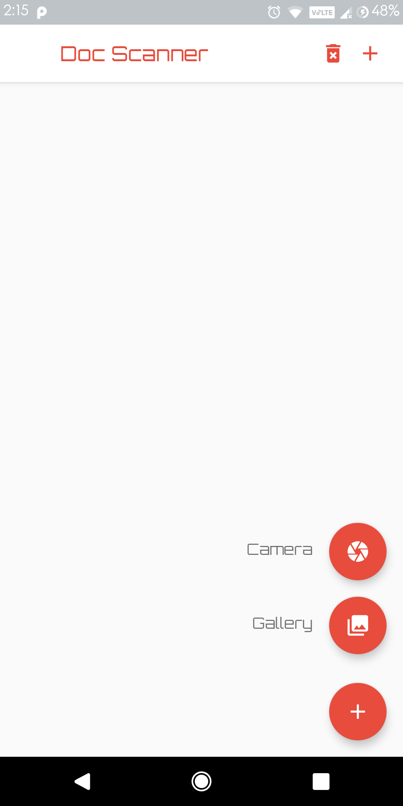
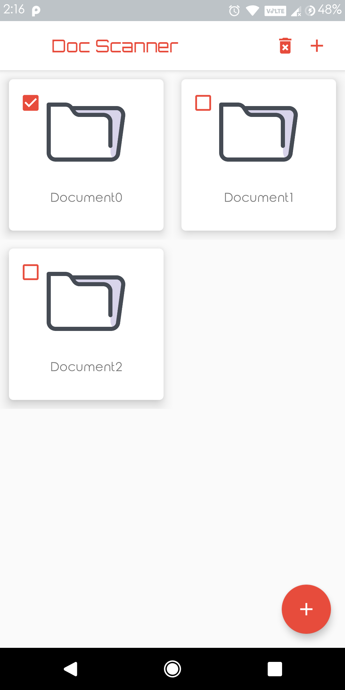
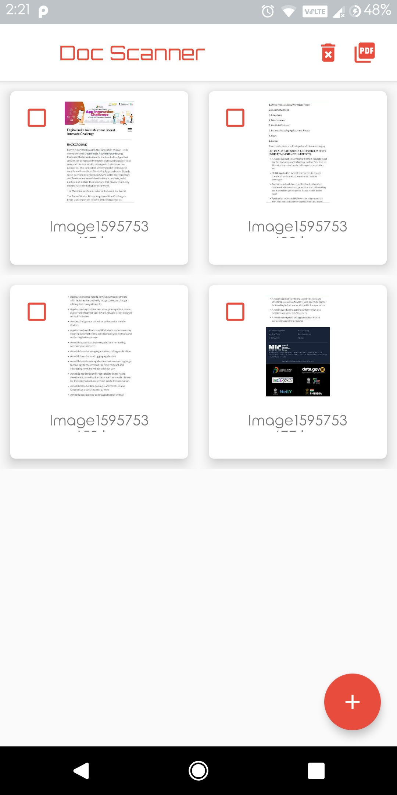
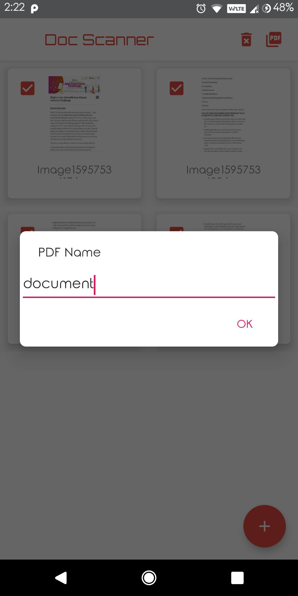
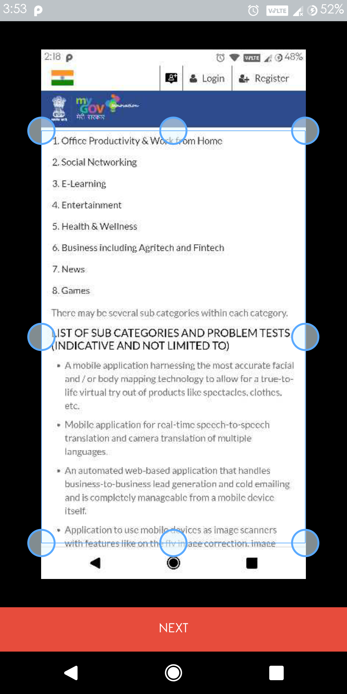
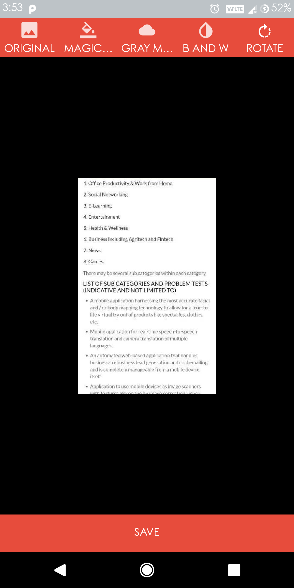

# Android-DocumentScanner
Android application to scan documents and export to JPEG or PDF formats.

Features
1) Capture the documents from phone camera.
2) Import documents from phone's gallery.
3) create, delete new document directory
4) add, delete document image files to directory
5) Export document to JPEG or PDF files

Screenshots
 

 

 
Libraries used
AndroidScannerDemo
https://github.com/jhansireddy/AndroidScannerDemo
